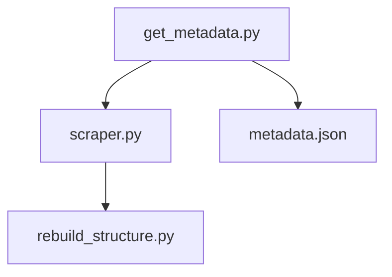

# DOGC-extractor

## About the project
This tool is part of the AINA project. As a brief description, "the AINA project will generate the digital and linguistic resources necessary to facilitate the development of applications based on Artificial Intelligence and Language Technologies such as voice assistants, automatic translators or conversational agents in Catalan".

The purpose of this tool is to extract all the publications of the Diari Oficial de la Generalitat de Catalunya (DOGC), both their metadata and the clean and well-structured plain text. This allows obtaining high quality legal texts for training generative models and comparable texts in Catalan and Spanish for training machine translators.

This extraction is done, firstly, through the Transparència Catalunya API, powered by Socrata (https://dev.socrata.com/foundry/analisi.transparenciacatalunya.cat/n6hn-rmy7), from which the metadata is obtained. Subsequently, the plain text is obtained from the html documents specified in the metadata. 

The idea of this repository is that it is scheduled to be executed at the beginning of each month, at which time the data is updated in the API. 

## Installation and setup
1. Clone the repo
```
git clone https://gitlab.bsc.es/lang-tech-unit/dogc-scraper.git
```
2. Install all the libraries specified in the requirements.txt:
```
pip install -r requirements.txt
```
3. Create a folder with the following structure:
```
-- data/
    -- output/
        -- ca/
        -- es/
    -- fixed/
        -- ca/
        -- es/
```
4. Ask for a free App Token in: https://analisi.transparenciacatalunya.cat/profile/edit/developer_settings

5. Create a **.env** file in the src/ folder with the following content:
```
# environment variables defined inside a .env file
APP_TOKEN= <INSERT HERE YOUR APP TOKEN>
PASSWORD= <INSERT HERE YOUR PASSWORD>
```

Tested under python 3.7.

### Deployment via docker compose
```docker-compose up -d --build```


## Usage
To run it without docker: ```src/scraper.py --es 1```

The three sripts that can be found in the source folder are executed in the order described below:


## Roadmap
- [ ] Enable option to download XML files.
- [ ] Enable option to download PDF files.
- [X] Develop an orquestator for the three steps.


## License
Apache 2.0

## Contact
Jorge Palomar - jorge.palomar@bsc.es \\
Language Technologies Unit - langtech@bsc.es

## Acknowledgments
This work was funded by Departament de la Vicepresidència i de Polítiques Digitals i Territori de la Generalitat de Catalunya within the framework of Projecte AINA.
